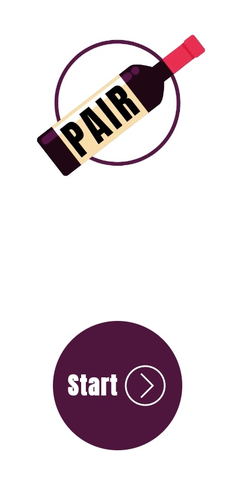
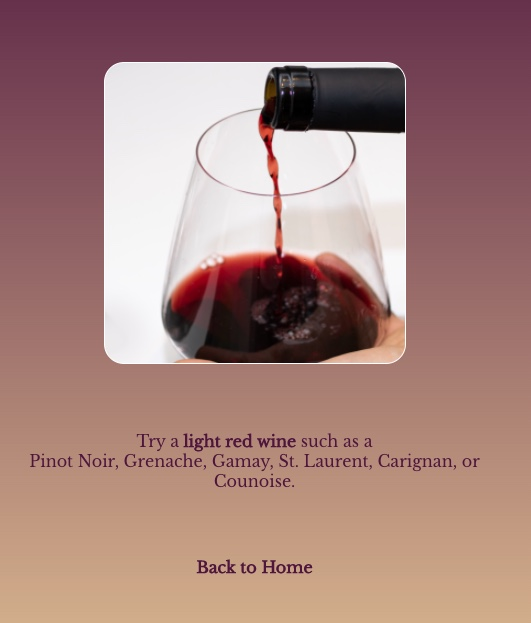
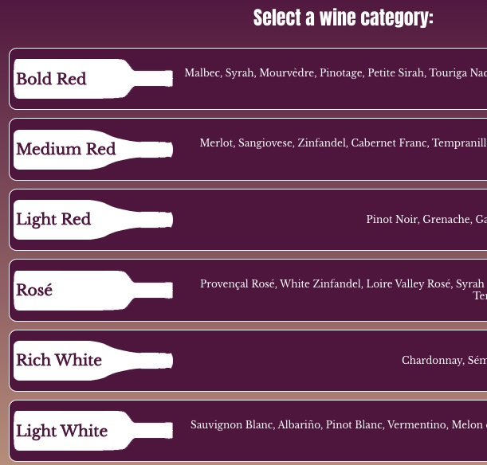

# Pair: a wine-pairing app
## Motivation
I've been enjoying Madeline Puckette and Justin Hammack's "Wine Folly: The Essential Guide to Wine" for several months now. Among their beautiful and logical tools, they have created a [very useful poster](https://media.winefolly.com/AF-Poster.png) breaking down types of wine and the foods they pair with. I decided to create an app using this logic, so that a user could navigate to a food/wine pairing on their mobile device, without consulting a large poster.

## Status
The project is live, hosted on Netlify [here](https://practical-morse-7e5ebc.netlify.app/).

## Setup
Node version 14.16.0
`nvm use 14.16.0`
`npm install`
`npm start`

## Screenshots


## Framework/tech used
- React
- React Router
- HTML, CSS, Javascript
- Edamam Recipe Search API

## Features
- Get a wine recommendation based on the ingredients of a recipe
- Get a recipe recommendation based on a type of wine

## Code Example
```
//listen for a change in selectedWine (in MenuWine), set the search url.
  useEffect(() => {
    //if a wine has been selected,
    if (selectedWine) {
      //get wine pairing array
      let pairingArray = wineTypes[selectedWine].pairingArray;
      //get array of food categories
      let foodTypeArray = Object.keys(foodTypes);
      //create array of arrays of food subcategories
      let foodSubtypeArray = [];
      foodTypeArray.forEach((type) => {
        foodSubtypeArray.push(Object.keys(foodTypes[type]));
      });
      //flatten the array of arrays into one big array
      let flatArray = foodSubtypeArray.flat();
      //create an array with only foods with a value of "2" from pairing array (great pairs). for now, we're being more general, so "pork" rather than "roast, tenderloin" etc.
      let masterArray = [];
      //sparkling and rose wines only have one 2 in their array, so in their case, we'll allow 1s.
      if (selectedWine === "sparkling" || selectedWine === "rose") {
        for (let i = 0; i < flatArray.length; i++) {
          if (pairingArray[i] >= 1) {
            masterArray.push(flatArray[i]);
          }
        }
        //otherwise it's gotta be 2s.
      } else {
        for (let i = 0; i < flatArray.length; i++) {
          if (pairingArray[i] === 2) {
            masterArray.push(flatArray[i]);
          }
        }
      }
      // select two random indices from the master array. One from each half of the array. This way you don't get two kinds of meat, or two prep methods.
      let num1 = Math.floor(Math.random() * (masterArray.length / 2));
      let num2 = Math.floor(
        Math.random() * (masterArray.length / 2) + masterArray.length / 2
      );

      // make our selections based on these indices
      let localPairFactor1 = masterArray[num1];
      let localPairFactor2 = masterArray[num2];

      //look out for spaces! Can't have those in a url. Change them to "%20"
      let localPairFactor1NoSpace = localPairFactor1;
      let localPairFactor2NoSpace = localPairFactor2;

      if (localPairFactor1NoSpace.includes(" ")) {
        let index = localPairFactor1NoSpace.indexOf(" ");
        localPairFactor1NoSpace =
          localPairFactor1NoSpace.slice(0, index) +
          "%20" +
          localPairFactor1NoSpace.slice(index + 1);
      }

      if (localPairFactor2NoSpace.includes(" ")) {
        let index = localPairFactor2NoSpace.indexOf(" ");
        localPairFactor2NoSpace =
          localPairFactor2NoSpace.slice(0, index) +
          "%20" +
          localPairFactor2NoSpace.slice(index + 1);
      }

      setRecipeUrl(
        `https://api.edamam.com/search?q=${localPairFactor1NoSpace}%20AND%20${localPairFactor2NoSpace}&app_id=d9740b8f&app_key=ef3b8ea5fd0b0bffed8b9bc13e135c91`
      );

      //set pairing factor with the vanilla (including spaces) names.
      setPairingFactor1(localPairFactor1);
      setPairingFactor2(localPairFactor2);
  
    }
  }, [selectedWine]);

```
## How to Use
You just need to have a recipe or bottle of wine on hand. The rest should be self-explanatory.

## Credits
Huge thanks to Madeline Puckette and Justin Hammack for making their pairing poster available for free online. Thanks to Nathaniel Stack for troubleshooting deploy, and to all my colleagues at General Assembly for their feedback and support.


